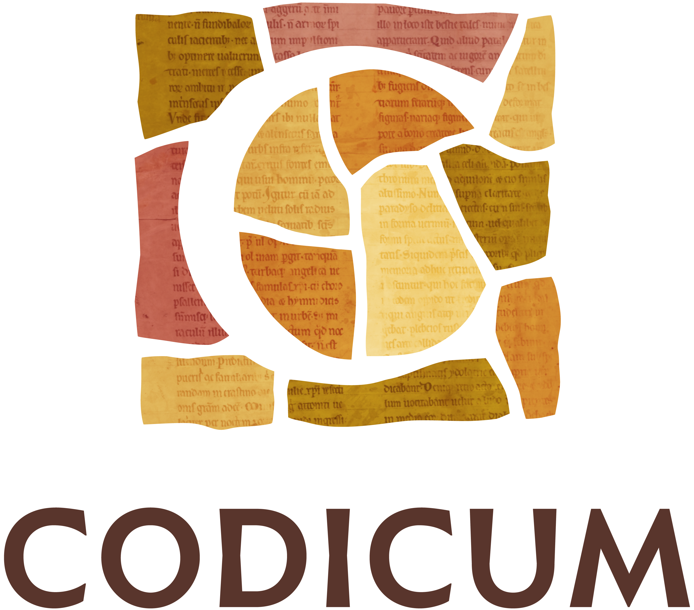

<p align="center">
  <a href="https://www.codicum.eu"></a>
</p>

# CODHMO — CODICUM Heritage Material Ontology

A thin domain ontology linking **heritage objects, material layers, samples,
analyses, evidence and competing hypotheses**, built so that AI agents reading the
graph cannot mistake a hypothesis for a fact.

CODHMO is developed within [**CODICUM**](https://www.codicum.eu), *Unlocking the
Medieval Book: Texts, Crafts, & Networks of Northern Europe*.

> **Draft (v0.1).** The namespace `https://codicum.eu/ontology/codhmo#` is provisional.

## The CODICUM project

CODICUM studies medieval manuscript fragments from Northern Europe, c. 1000–1500,
combining manuscript studies, scientific analysis and digital methods. The aim is
to reconstruct lost books, follow how knowledge and craft moved between Northern
Europe and the rest of the continent, and recover the stories these fragments
still carry. Partners are the University of Bergen, the University of Helsinki,
the University of Southern Denmark, the University of Copenhagen, the Swedish
National Archives and the Royal Danish Library.

CODHMO is the project's semantic layer for the *scientific* side of that work:
what a parchment, adhesive or ink is made of, where a sample was taken, and which
identifications the evidence supports or contradicts.

## What it reuses

CODHMO defines only what existing standards lack. It builds on
[CIDOC CRM 7.1.3](https://www.cidoc-crm.org/), CRMsci 3.2, CRMinf 1.2.1 and
[PROV-O](https://www.w3.org/TR/prov-o/). Taxa are numeric NCBI taxid IRIs, and
identifications are always reified propositions.

## Measurement data: ZoomzPeak

CODHMO holds interpretation, not spectra. Measurements live in
[**ZoomzPeak**](https://github.com/Palaeoprot/ZoomzPeak), the prospective palaeoproteomics
metadata standard and data format being developed by the [**PAASTA**](https://paasta-community.github.io/) community. A `codhmo:SourceRecord` points an observation at
one ZoomzPeak row by table, key columns and schema version
([D23](docs/design-decisions.md)). `queries/q11` walks from that row back to the
observation, hypothesis, sample and object.

## Repository layout

| Path | Contents |
|---|---|
| [`ontology/codhmo.ttl`](ontology/codhmo.ttl) | Core ontology |
| [`shapes/codhmo-core-shapes.ttl`](shapes/codhmo-core-shapes.ttl) | SHACL rules (Violation = MUST, Warning = SHOULD) |
| [`queries/`](queries) | Agent questions as SPARQL (q01–q11) |
| [`examples/`](examples) | Worked instances from published cases, plus synthetic fixtures |
| [`alignment/codhmo-matrix.csv`](alignment/codhmo-matrix.csv) | Term-by-term reuse decisions |
| [`docs/design-decisions.md`](docs/design-decisions.md) | Decisions D1–D23 and open items |
| [`tools/check_ncbi_taxa.py`](tools/check_ncbi_taxa.py) | Checks example taxids against NCBI |

## Running the tests

```bash
python -m pytest -q tests
```

## Licence

CODHMO is licensed under the [**European Union Public Licence**](https://commission.europa.eu/about/departments-and-executive-agencies/digital-services/open-source-strategy-history/european-union-public-licence_en)

## Funding


This project has received funding from the European Union's EU Framework Programme
for Research and Innovation Horizon Europe under Grant Agreement No. 101166995.
The European Research Executive Agency is not responsible for any use that may be made of the
information it contains.
